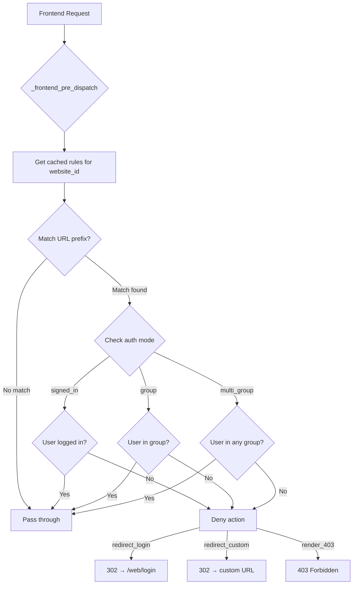
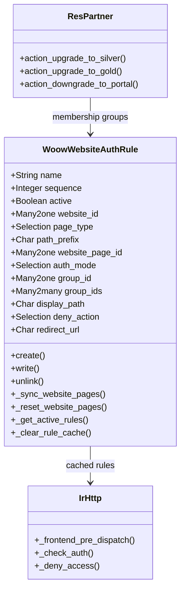
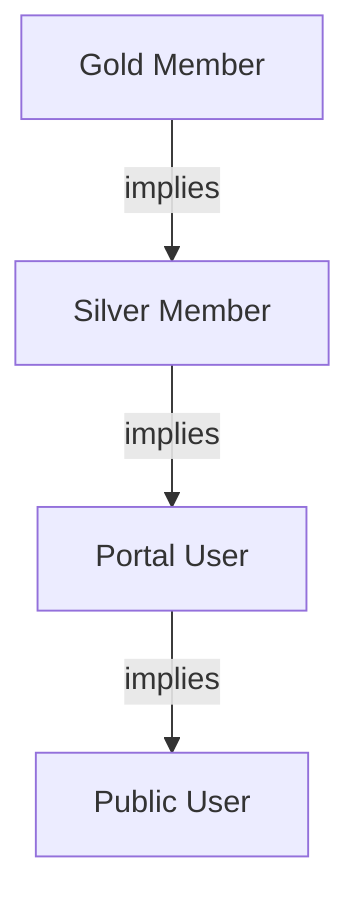
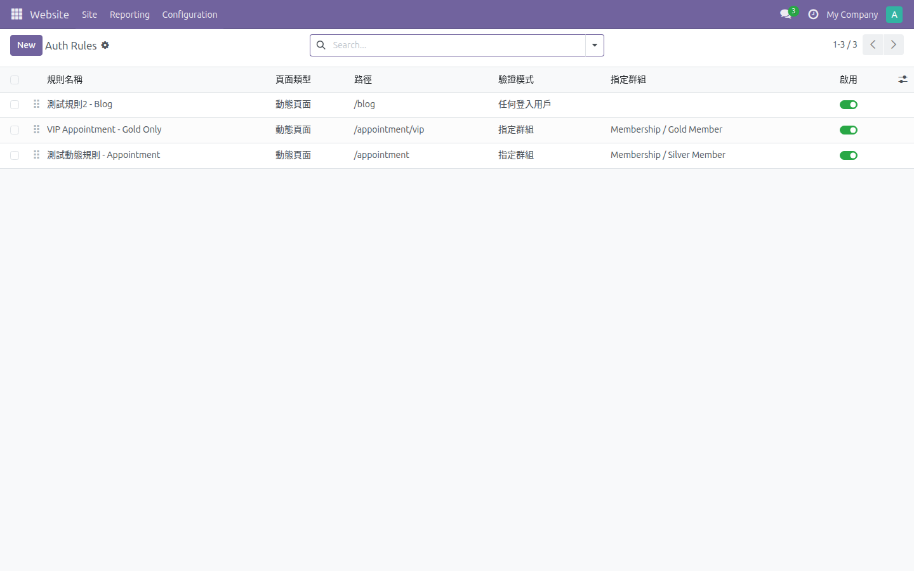
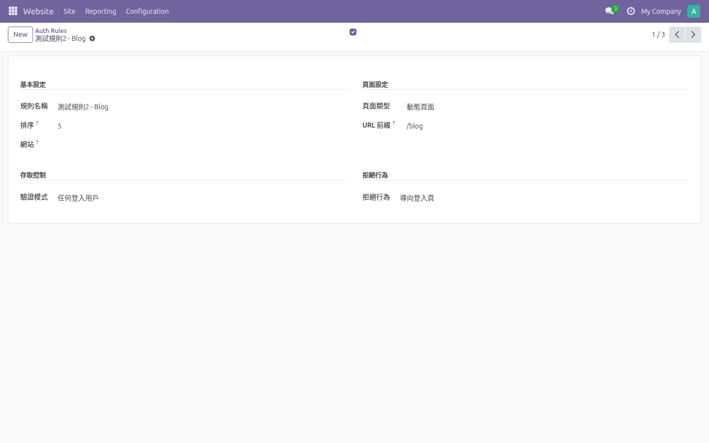
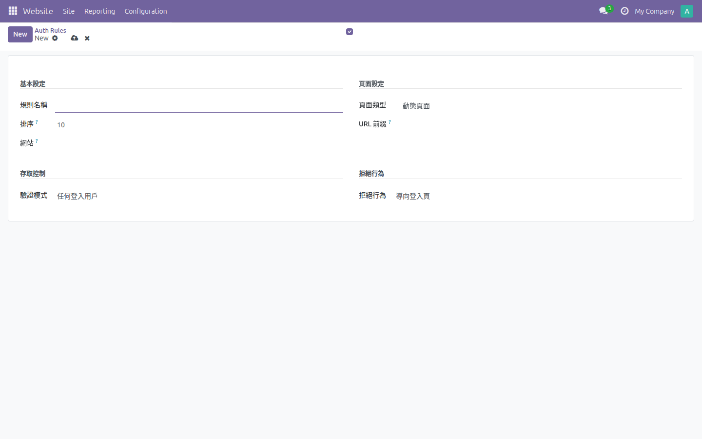
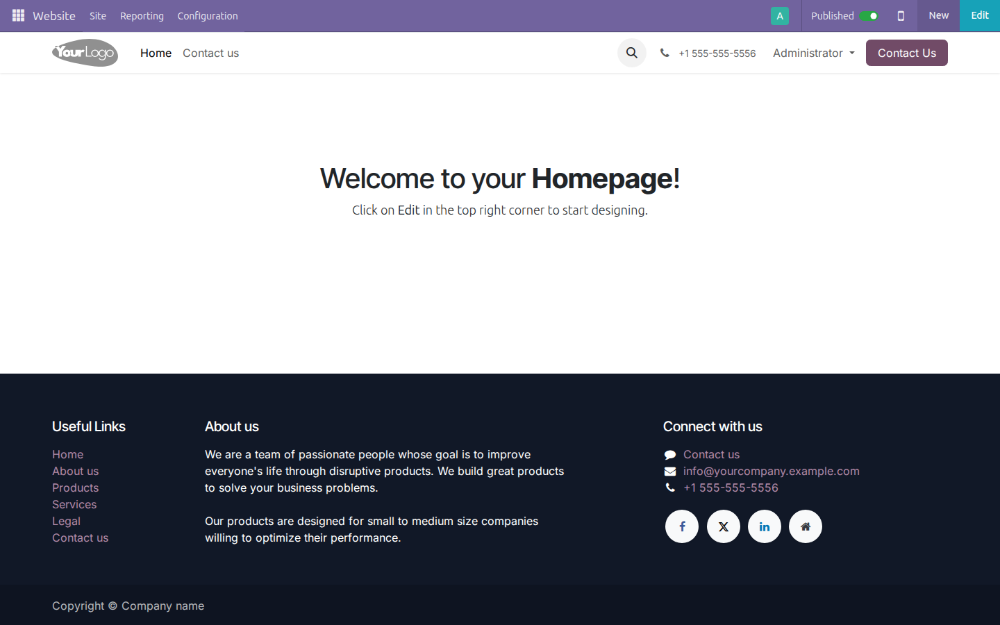
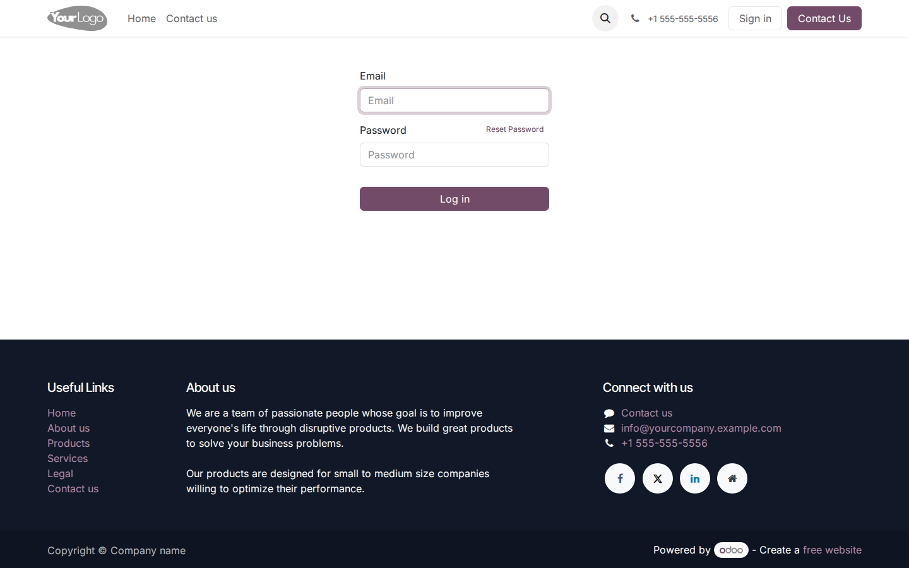

<p align="center">
  
</p>

<h1 align="center">Woow Website Auth</h1>

<p align="center">
  <strong>Unified Website Page Access Control for Odoo 18 Community</strong><br/>
  Centralized auth rules for dynamic and static page protection with membership group hierarchy
</p>

<p align="center">
  <a href="#overview">Overview</a> &bull;
  <a href="#features">Features</a> &bull;
  <a href="#architecture">Architecture</a> &bull;
  <a href="#module-structure">Module Structure</a> &bull;
  <a href="#screenshots">Screenshots</a> &bull;
  <a href="#installation">Installation</a> &bull;
  <a href="#configuration">Configuration</a> &bull;
  <a href="#security">Security</a> &bull;
  <a href="#testing">Testing</a> &bull;
  <a href="README_zh-TW.md">中文文件</a>
</p>

<p align="center">
  
  
  
  
  
</p>

---

## Overview

**woow_website_auth** is an Odoo 18 module that provides centralized management of website page access control. Administrators can create auth rules to protect both dynamic (URL prefix-based) and static (`website.page`) pages from unauthorized access. Rules are evaluated on every frontend request via `ir.http._frontend_pre_dispatch()`, using a first-match-stops strategy ordered by sequence number.

The module also introduces a membership group hierarchy (Silver Member, Gold Member) with chained inheritance, and provides a partner-level API for upgrading and downgrading user membership tiers programmatically. All active rules are cached per `website_id` using Odoo's `ormcache` for high-performance request interception with zero database overhead on every page load.

### Why This Module?

| Challenge | Solution |
|-----------|----------|
| No centralized page access control in Odoo Community | Unified auth rule management under Website > Configuration > Auth Rules |
| Dynamic pages (URLs) cannot be protected without custom code | URL prefix matching intercepts any dynamic route (e.g., `/appointment`, `/blog`) |
| Static pages require manual visibility editing per page | Auth rules auto-sync visibility settings to `website.page` records |
| Only simple login-required checks are available | Three auth modes: `signed_in`, `group`, and `multi_group` |
| No flexible deny behavior | Three deny actions: redirect to login, redirect to custom URL, or render 403 |
| Membership tiers require complex group management | Chained group hierarchy (Gold implies Silver implies Portal) with one-click upgrade/downgrade |
| Rule evaluation hits database on every request | `ormcache` per `website_id` with automatic cache invalidation on CRUD operations |

---

## Features

### Core Capabilities

- **Dynamic Page Protection** -- Match frontend URLs by prefix (e.g., `/appointment`, `/blog`, `/shop/premium`) and intercept unauthorized access before the page is rendered.
- **Static Page Protection** -- Sync auth rules directly to `website.page` visibility settings; changes are applied immediately and reversed when rules are deactivated or deleted.
- **Three Auth Modes** -- `signed_in` (any logged-in user), `group` (specific user group), `multi_group` (any of multiple groups).
- **Three Deny Actions** -- `redirect_login` (302 to `/web/login` with redirect parameter), `redirect_custom` (302 to a custom URL), `render_403` (403 Forbidden page).
- **Sequence-Based Priority** -- First-match-stops evaluation with drag-and-drop reordering in the list view.
- **Multi-Website Support** -- Rules can be scoped to a specific website or applied globally across all websites.

### Performance & Caching

- **ormcache** -- Active rules are cached per `website_id`, eliminating database queries on every frontend request.
- **Automatic Cache Invalidation** -- Cache is cleared on `create()`, `write()`, and `unlink()` operations.
- **Dict-Based Cache Values** -- Rules are stored as plain dictionaries (not recordsets) to avoid ORM cache issues.

### Membership System

- **Group Hierarchy** -- Gold Member implies Silver Member implies Portal User implies Public User.
- **Partner Upgrade/Downgrade API** -- `action_upgrade_to_silver()`, `action_upgrade_to_gold()`, `action_downgrade_to_portal()` methods on `res.partner`.
- **Graceful Skip** -- Partners without linked user accounts are silently skipped during upgrade/downgrade operations.

### Static Page Sync

- **Bidirectional Lifecycle** -- Creating or updating a rule syncs visibility to `website.page`; deactivating or deleting a rule restores the page to public.
- **Visibility Mapping** -- `signed_in` maps to `connected`, `group` maps to `restricted_group` with the specified `groups_id`.

---

## Architecture

### High-Level Flow

```
┌─────────────┐     ┌──────────────────┐     ┌──────────────────────┐
│   Visitor    │────>│   Odoo Website   │────>│  woow_website_auth   │
│  (Browser)   │<────│  (ir.http)       │<────│  (Auth Rules Engine) │
└─────────────┘     └──────────────────┘     └──────────────────────┘
     Request       _frontend_pre_dispatch()    _get_active_rules()
     Response       Match URL prefix           _check_auth()
                    Deny or Pass               _deny_access()
```

### Request Interception Flow



### Class Diagram



### Membership Group Hierarchy



---

## Module Structure

```
woow_website_auth/
├── __init__.py                          # Module root init
├── __manifest__.py                      # Module manifest (v18.0.1.0.0)
├── models/
│   ├── __init__.py                      # Models init
│   ├── ir_http.py                       # Frontend interception engine
│   │                                    #   _frontend_pre_dispatch() override,
│   │                                    #   _check_auth(), _deny_access()
│   ├── res_partner.py                   # Membership upgrade/downgrade API
│   │                                    #   action_upgrade_to_silver(),
│   │                                    #   action_upgrade_to_gold(),
│   │                                    #   action_downgrade_to_portal()
│   └── website_auth_rule.py             # Core rule model with CRUD overrides,
│                                        #   static page sync, ormcache,
│                                        #   onchange handlers
├── security/
│   ├── ir.model.access.csv              # ACL: System Admin + Website Designer
│   └── security.xml                     # Membership groups (Silver, Gold)
│                                        #   with chained implied_ids
├── static/
│   └── description/
│       └── icon.png                     # Module icon
└── views/
    ├── menu.xml                         # Website > Configuration > Auth Rules
    └── website_auth_rule_views.xml      # List view (with sequence handle)
                                         #   + Form view (dynamic field visibility)
```

---

## Screenshots

### Auth Rules List View

<p align="center">
  
</p>
<p align="center"><em>Auth Rules list view with sequence handles for drag-and-drop reordering</em></p>

### Dynamic Rule Form View

<p align="center">
  
</p>
<p align="center"><em>Dynamic page rule configuration with URL prefix, auth mode, and deny action settings</em></p>

### New Auth Rule Form

<p align="center">
  
</p>
<p align="center"><em>Creating a new auth rule with page type selection and auth mode configuration</em></p>

### Website Application

<p align="center">
  
</p>
<p align="center"><em>Odoo Website application with Auth Rules accessible from the Configuration menu</em></p>

### Login Redirect

<p align="center">
  
</p>
<p align="center"><em>Unauthenticated users are redirected to the login page with a redirect parameter</em></p>

### Unauthenticated Redirect

<p align="center">
  
</p>
<p align="center"><em>Redirect behavior for unauthenticated visitors attempting to access protected pages</em></p>

---

## Installation

### Prerequisites

- **Odoo 18.0** (Community or Enterprise)
- **PostgreSQL 13+**
- **Python 3.10+**
- **Docker / Podman** (recommended for containerized deployment)

### Standard Odoo Installation

1. **Clone the repository** into your Odoo addons directory:

   ```bash
   cd /path/to/odoo/addons
   git clone https://github.com/WOOWTECH/Woow_odoo_website_auth.git
   ```

2. **Add to addons path** in your Odoo configuration file (`odoo.conf`):

   ```ini
   addons_path = /path/to/odoo/addons,/path/to/odoo/addons/Woow_odoo_website_auth
   ```

3. **Update the module list** in Odoo:

   - Navigate to **Apps** and click **Update Apps List**
   - Search for **"Woow Website Auth"**
   - Click **Install**

4. **Ensure dependencies** are installed:

   - The `website` module must be installed (Odoo's built-in Website module)

### Docker / Podman Deployment

A ready-to-use container setup is provided in the `podman_docker_app/odoo-websiteauth/` directory.

1. **Start the containers:**

   ```bash
   cd podman_docker_app/odoo-websiteauth/
   docker compose up -d
   # or
   podman-compose up -d
   ```

   This starts two containers:
   - `odoo-websiteauth-web` -- Odoo 18 (mapped to internal 8069)
   - `odoo-websiteauth-db` -- PostgreSQL

2. **Access Odoo** at the configured port (see `docker-compose.yml`).

3. **Module auto-mount:** The `woow_website_auth` module is automatically mounted at `/mnt/extra-addons` inside the container.

4. **Install the module** through the Odoo Apps interface as described above.

### Quick Install Script

```bash
# Use the included install script
chmod +x install.sh
./install.sh
```

---

## Configuration

After installation, configure auth rules for your website pages:

### Step 1: Access Auth Rules

Navigate to **Website > Configuration > Auth Rules**.

### Step 2: Create a New Rule

| Field | Description | Example |
|---|---|---|
| **Rule Name** (`name`) | Descriptive name for the rule. | `Protect Appointments` |
| **Sequence** (`sequence`) | Priority order (lower = higher priority). | `10` |
| **Active** (`active`) | Enable or disable the rule. | `True` |
| **Website** (`website_id`) | Scope to a specific website, or leave empty for all websites. | *(empty)* |

### Step 3: Choose Page Type

| Page Type | Description |
|---|---|
| **Dynamic** (`dynamic`) | Matches URLs by prefix. Use for routes like `/appointment`, `/blog`, `/shop/premium`. |
| **Static** (`static`) | Binds to a specific `website.page` record. Visibility is synced directly to the page. |

### Step 4: Set Auth Mode

| Auth Mode | Description |
|---|---|
| **Signed In** (`signed_in`) | Any logged-in user can access the page. |
| **Group** (`group`) | Only users belonging to a specific group can access. |
| **Multi Group** (`multi_group`) | Users belonging to ANY of the selected groups can access. Dynamic pages only. |

### Step 5: Configure Deny Action

| Deny Action | Description | Additional Field |
|---|---|---|
| **Redirect to Login** (`redirect_login`) | 302 redirect to `/web/login` with a `redirect` parameter for post-login return. | -- |
| **Redirect to Custom URL** (`redirect_custom`) | 302 redirect to a custom URL. | `redirect_url` (e.g., `/membership/upgrade`) |
| **Render 403** (`render_403`) | Show 403 Forbidden page to the user. | -- |

### Step 6: Membership Groups

The module creates two membership groups with chained inheritance:

| Group | XML ID | Implies |
|---|---|---|
| **Silver Member** | `woow_website_auth.group_member_silver` | `base.group_portal` |
| **Gold Member** | `woow_website_auth.group_member_gold` | `woow_website_auth.group_member_silver` |

Use the partner API to manage membership tiers:

```python
# Upgrade a partner to Silver Member
partner.action_upgrade_to_silver()

# Upgrade a partner to Gold Member
partner.action_upgrade_to_gold()

# Downgrade a partner back to Portal
partner.action_downgrade_to_portal()
```

---

## Security

### Access Control

Auth rule management is restricted to two groups:

| Group | XML ID | Permissions |
|---|---|---|
| **System Admin** | `base.group_system` | Full CRUD on `woow.website.auth.rule` |
| **Website Designer** | `website.group_website_designer` | Full CRUD on `woow.website.auth.rule` |

Portal users and public users have no access to auth rule records. Attempting to read or write rules from a portal user context will raise an `AccessError`.

### Static Page Sync

When syncing auth rules to `website.page` records, all writes are performed via `sudo()` to ensure the sync succeeds regardless of the current user's permissions. This is safe because the CRUD methods on `woow.website.auth.rule` are already protected by the ACL rules above.

### Frontend Interception

The `_frontend_pre_dispatch()` method runs on every frontend request. It reads rules from the `ormcache` (no database access) and checks user permissions using `user._is_public()` and `user.has_group()` -- both standard Odoo security primitives.

### Input Validation

- **Required fields** -- `name`, `page_type`, `auth_mode`, and `deny_action` are all required.
- **Onchange handlers** -- Switching page type or auth mode automatically clears irrelevant fields to prevent stale data.
- **Empty prefix handling** -- Rules with empty `path_prefix` values are skipped during URL matching.

---

## Testing

### Test Results Summary

The module has been verified with **25 comprehensive test cases** covering all features, edge cases, and security boundaries:

| # | Test | Result |
|---|------|--------|
| T0 | Login Odoo admin | **PASS** |
| T1 | Auth Rules menu exists | **PASS** |
| T2 | Dynamic page rule form switching | **PASS** |
| T3 | Static page rule form switching | **PASS** |
| T4 | deny_action switching | **PASS** |
| T5 | Sequence/sorting | **PASS** |
| T6 | Static page sync signed_in | **PASS** (bug fixed) |
| T7 | Static page sync group | **PASS** |
| T8 | Deactivate rule restores page | **PASS** |
| T9 | Unauthenticated redirect to login | **PASS** |
| T10 | Portal user redirect custom URL | **PASS** |
| T11 | Silver member passes through | **PASS** |
| T12 | Member upgrade/downgrade cycle | **PASS** |
| T13 | Edge cases (empty prefix, 403, no website) | **PASS** |
| T14 | Gold + sub-path prefix | **PASS** |
| T15 | Nested prefix priority with sequence | **PASS** |
| T16 | Deactivate dynamic rule stops protection | **PASS** |
| T17 | Delete static rule restores page | **PASS** |
| T18 | display_path computed correctly | **PASS** |
| T19 | ormcache clears on CRUD | **PASS** |
| T20 | website_id filtering | **PASS** |
| T21 | multi_group interception | **PASS** |
| T22 | Security: portal user gets AccessError | **PASS** |
| T23 | render_403 for logged-in users | **PASS** |
| T24 | Partner without user -- graceful skip | **PASS** |

**Result: 25/25 PASS (100%)**

### Bug Found and Fixed

During testing, 1 bug was discovered and fixed:

- **T6 -- Static page sync signed_in**: The original code wrote `visibility: 'signed_in'` to `website.page`, but Odoo 18 expects `visibility: 'connected'`. Fixed in `_sync_website_pages()`.

### Running the Tests

```bash
# Run all woow_website_auth tests
./odoo-bin -d your_database --test-enable --stop-after-init -i woow_website_auth

# Run with Docker
docker exec -it odoo-websiteauth-web \
  odoo --test-enable --stop-after-init -d odoo -i woow_website_auth
```

Test plans and results are documented in the `docs/plans/` directory.

---

## Changelog

### v18.0.1.0.0 (Initial Release)

- Centralized auth rule model (`woow.website.auth.rule`) with CRUD overrides
- Dynamic page protection via URL prefix matching in `_frontend_pre_dispatch()`
- Static page protection with automatic `website.page` visibility sync
- Three auth modes: `signed_in`, `group`, `multi_group`
- Three deny actions: `redirect_login`, `redirect_custom`, `render_403`
- Sequence-based priority with first-match-stops evaluation
- `ormcache` per `website_id` with automatic invalidation on CRUD
- Membership group hierarchy: Gold implies Silver implies Portal
- Partner upgrade/downgrade API on `res.partner`
- Multi-website support (website-specific or global rules)
- ACL restricted to System Admin and Website Designer
- Onchange handlers for clean form field transitions
- Computed `display_path` field for list view
- Docker / Podman deployment configuration
- 25 comprehensive test cases (25/25 PASS)
- Bug fix: `visibility: 'signed_in'` corrected to `'connected'` for Odoo 18

---

## Support

- **Author:** [WoowTech](https://www.woowtech.com)
- **Issues:** [GitHub Issues](https://github.com/WOOWTECH/Woow_odoo_website_auth/issues)

---

## License

This module is licensed under the **GNU Lesser General Public License v3.0 (LGPL-3)**.

See [LICENSE](https://www.gnu.org/licenses/lgpl-3.0.html) for details.

---

<p align="center"><sub>Built by <a href="https://github.com/WOOWTECH">WOOWTECH</a> &bull; Powered by Odoo 18</sub></p>
