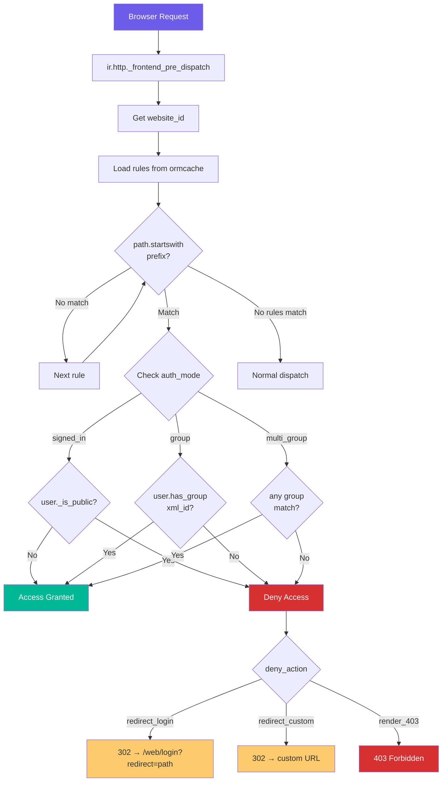
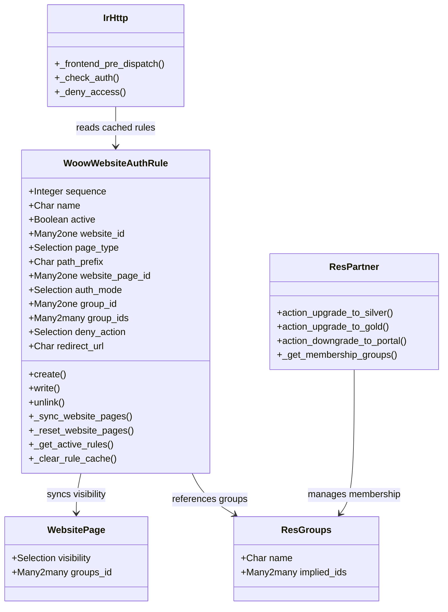
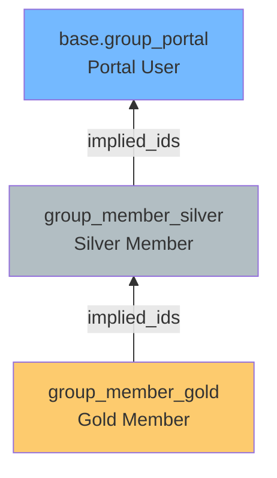

<p align="center">
  
</p>

<h1 align="center">Woow 網站存取控制</h1>

<p align="center">
  <strong>會員制網站統一頁面存取控制方案 — Odoo 18</strong><br/>
  為動態與靜態頁面提供集中式存取控制規則管理
</p>

<p align="center">
  <a href="#概述">概述</a> &bull;
  <a href="#功能特色">功能特色</a> &bull;
  <a href="#系統架構">系統架構</a> &bull;
  <a href="#模組結構">模組結構</a> &bull;
  <a href="#功能截圖">功能截圖</a> &bull;
  <a href="#安裝說明">安裝說明</a> &bull;
  <a href="#設定指南">設定指南</a> &bull;
  <a href="#安全機制">安全機制</a> &bull;
  <a href="#測試報告">測試報告</a> &bull;
  <a href="README.md">English</a>
</p>

<p align="center">
  
  
  
  
  
</p>

---

## 概述

**Woow Website Auth** 是一個 Odoo 18 社區版單模組附加套件，為會員制網站提供集中式頁面存取控制管理系統。管理員可在後台建立存取控制規則，統一保護動態頁面（URL 前綴比對）和靜態頁面（`website.page`），無需逐頁手動設定。

<p align="center">
  
</p>

### 為什麼選擇此模組？

| 挑戰 | 解決方案 |
|------|----------|
| 動態頁面無原生存取控制 | URL 前綴比對攔截引擎，保護 `/appointment`、`/blog` 等路徑 |
| 靜態頁面權限需逐頁設定 | 規則自動同步至 `website.page` 的 visibility 設定 |
| 會員等級管理分散 | 內建 Silver / Gold 會員群組，鏈式繼承 Portal 權限 |
| 未授權存取缺乏彈性處理 | 三種拒絕行為：導向登入頁、自訂 URL、403 頁面 |
| 多網站環境規則管理困難 | 規則可指定特定網站或適用所有網站 |
| 每次請求查詢效能瓶頸 | ormcache 快取機制，CRUD 時自動清除 |

---

## 功能特色

### 動態頁面保護

- **URL 前綴比對** — 以 `startswith` 比對請求路徑（如 `/appointment`、`/blog`、`/shop/vip`）
- **前台攔截引擎** — 繼承 `ir.http._frontend_pre_dispatch()`，在 controller 處理前攔截
- **排序優先機制** — 依 `sequence` 排序，第一條命中即停止，支援拖曳排序
- **多網站支援** — 規則可指定特定網站或留空適用所有網站

### 靜態頁面保護

- **規則同步** — 儲存規則時自動同步至 `website.page` 的 `visibility` 與 `groups_id`
- **停用還原** — 規則停用或刪除時，自動還原靜態頁面為公開狀態
- **單向同步** — 規則 → `website.page`（不反向讀取）

### 三種驗證模式

- **`signed_in`** — 任何已登入用戶即可存取
- **`group`** — 僅限指定群組成員（透過 `has_group()` 以 xml_id 驗證）
- **`multi_group`** — 多群組任一即可通過（僅動態頁面支援）

### 三種拒絕行為

- **`redirect_login`** — 導向登入頁，帶 `redirect` 參數以便登入後返回原路徑
- **`redirect_custom`** — 導向自訂 URL（如 `/membership/upgrade`）
- **`render_403`** — 顯示 403 禁止存取頁面

### 會員等級群組

- **Silver Member** — 銀級會員，繼承 Portal 權限（`implied_ids → base.group_portal`）
- **Gold Member** — 金級會員，繼承 Silver 權限（自動包含 Portal）
- **升降級 API** — `action_upgrade_to_silver`、`action_upgrade_to_gold`、`action_downgrade_to_portal`

### 快取機制

- **ormcache** — 規則按 `website_id` 快取，避免每次請求查詢資料庫
- **自動清除** — 規則新增、修改、刪除時呼叫 `registry.clear_cache()`
- **dict 回傳** — 快取回傳 dict 列表，避免 recordset cache 問題

---

## 系統架構

### 系統總覽

```
┌─────────────────────────────────────────────────────────────────┐
│                   Woow Website Auth 模組                         │
├─────────────────────────────────────────────────────────────────┤
│                                                                  │
│  前台請求攔截層                                                  │
│  ┌───────────────────────────────────────────────────────────┐   │
│  │  ir.http._frontend_pre_dispatch()                         │   │
│  │                                                           │   │
│  │  1. 取得 website_id                                       │   │
│  │  2. 從 ormcache 載入規則                                  │   │
│  │  3. 按 sequence 排序，startswith 比對路徑                 │   │
│  │  4. 第一條命中 → 檢查權限 → 通過/拒絕                    │   │
│  └────────────────────────────┬──────────────────────────────┘   │
│                               │                                  │
│  核心規則模型                 │                                  │
│  ┌────────────────────────────┼──────────────────────────────┐   │
│  │  woow.website.auth.rule                                   │   │
│  │                                                           │   │
│  │  • CRUD 覆寫（sync + cache clear）                        │   │
│  │  • _sync_website_pages()  → 同步靜態頁面                  │   │
│  │  • _reset_website_pages() → 還原為公開                    │   │
│  │  • _get_active_rules()    → ormcache 快取                 │   │
│  └────────────────────────────┬──────────────────────────────┘   │
│                               │                                  │
│  ┌──────────────┐  ┌──────────┼─────┐  ┌─────────────────────┐  │
│  │ res.partner  │  │ website.page   │  │ res.groups          │  │
│  │              │  │                │  │                     │  │
│  │ • upgrade_   │  │ • visibility   │  │ • Silver Member     │  │
│  │   to_silver  │  │ • groups_id    │  │ • Gold Member       │  │
│  │ • upgrade_   │  │   (同步目標)   │  │ • implied_ids 鏈    │  │
│  │   to_gold    │  │                │  │                     │  │
│  │ • downgrade_ │  │                │  │                     │  │
│  │   to_portal  │  │                │  │                     │  │
│  └──────────────┘  └────────────────┘  └─────────────────────┘  │
│                                                                  │
├──────────────────────────────────────────────────────────────────┤
│                    Odoo 18 框架                                   │
│  website │ ir.http │ ORM │ ormcache │ res.groups │ res.users     │
├──────────────────────────────────────────────────────────────────┤
│                    PostgreSQL 資料庫                               │
│              規則設定 │ 頁面狀態 │ 群組成員                       │
└─────────────────────────────────────────────────────────────────┘
```

### 請求攔截流程



### 類別關聯圖



### 會員群組階層



---

## 模組結構

```
woow_website_auth/
├── __init__.py
├── __manifest__.py
├── models/
│   ├── __init__.py
│   ├── ir_http.py               # 前台攔截引擎 (_frontend_pre_dispatch)
│   ├── res_partner.py           # 會員升降級 API
│   └── website_auth_rule.py     # 核心規則模型（CRUD、同步、快取）
├── security/
│   ├── ir.model.access.csv      # 存取控制清單
│   └── security.xml             # 會員群組定義（Silver、Gold）
├── static/
│   └── description/
│       └── icon.png
└── views/
    ├── menu.xml                  # Website > Configuration > Auth Rules
    └── website_auth_rule_views.xml  # 列表與表單視圖
```

---

## 功能截圖

### 存取控制規則列表

後台規則列表視圖，顯示規則名稱、頁面類型、路徑、驗證模式與啟用狀態。支援拖曳排序。

<p align="center">
  
</p>

### 動態規則表單

動態頁面規則的表單視圖，設定 URL 前綴、驗證模式和拒絕行為。

<p align="center">
  
</p>

### 新增規則表單

新增規則時的空白表單，包含基本設定、頁面設定、存取控制和拒絕行為四個區塊。

<p align="center">
  
</p>

### Website 應用程式

Odoo Website 應用程式選單，Auth Rules 位於 Configuration 下方。

<p align="center">
  
</p>

### 登入頁面重導向

未登入用戶存取受保護頁面時，自動導向登入頁並帶有 `redirect` 參數。

<p align="center">
  
</p>

### 未授權存取重導向

未登入用戶嘗試存取受保護的動態頁面時，被攔截並重導向至登入頁。

<p align="center">
  
</p>

---

## 安裝說明

### 系統需求

- **Odoo 18.0**（社區版或企業版）
- **Python 3.10+**
- **PostgreSQL 13+**
- **Docker / Podman**（建議使用容器化部署）

### 步驟一：複製儲存庫

```bash
git clone https://github.com/WOOWTECH/Woow_odoo_website_auth.git
```

### 步驟二：複製模組到 Odoo addons 目錄

```bash
cp -r Woow_odoo_website_auth/woow_website_auth /path/to/odoo/addons/
```

### 步驟三：Docker / Podman 部署

```bash
# 使用內附的 Docker Compose 設定
cd Woow_odoo_website_auth/podman_docker_app/odoo-websiteauth
docker compose up -d
```

### 步驟四：在 Odoo 中安裝模組

1. 前往 **應用程式** 選單
2. 點擊 **更新應用程式列表**
3. 搜尋「Woow Website Auth」
4. 點擊 **安裝**

### 安裝驗證

安裝後前往 **Website > Configuration > Auth Rules**，若看到規則列表（空白），代表安裝成功。

---

## 設定指南

### 1. 建立動態頁面規則

前往 **Website > Configuration > Auth Rules > 新增**

| 欄位 | 說明 | 範例 |
|------|------|------|
| **規則名稱** | 規則的識別名稱 | 「保護預約頁面」 |
| **排序** | 優先級（數字越小越優先） | 10 |
| **頁面類型** | 選擇「動態頁面」 | `dynamic` |
| **URL 前綴** | 要保護的路徑前綴 | `/appointment` |
| **驗證模式** | 存取條件 | `signed_in` / `group` / `multi_group` |
| **拒絕行為** | 未通過時的處理 | `redirect_login` |
| **網站** | 適用的網站（留空 = 所有） | — |

### 2. 建立靜態頁面規則

| 欄位 | 說明 | 範例 |
|------|------|------|
| **頁面類型** | 選擇「靜態頁面」 | `static` |
| **靜態頁面** | 選擇 `website.page` 記錄 | 「VIP 專區」 |
| **驗證模式** | `signed_in` 或 `group`（不支援 `multi_group`） | `group` |

> **注意：** 靜態頁面不支援 `multi_group` 驗證模式。切換到靜態頁面時，若 `auth_mode` 為 `multi_group` 會自動重設為 `signed_in`。

### 3. 設定拒絕行為

| 拒絕行為 | 說明 | 設定 |
|----------|------|------|
| **導向登入頁** | 未登入用戶導向 `/web/login?redirect=原路徑` | 預設選項 |
| **導向自訂 URL** | 導向指定的升級頁面 | 填寫 `redirect_url`，如 `/membership/upgrade` |
| **顯示 403 頁面** | 直接顯示 403 禁止存取頁面 | 無需額外設定 |

### 4. 管理會員等級

透過 JSON-RPC 或後台操作 `res.partner` 上的方法：

```python
# 升級為 Silver 會員
partner.action_upgrade_to_silver()

# 升級為 Gold 會員（自動包含 Silver 權限）
partner.action_upgrade_to_gold()

# 降級為純 Portal
partner.action_downgrade_to_portal()
```

### 5. 規則優先順序

規則按 `sequence` 欄位排序，**第一條命中即停止**。可在列表視圖中拖曳調整順序。

```
sequence=10  /appointment/vip  → group: Gold Member
sequence=20  /appointment      → signed_in
sequence=30  /blog             → group: Silver Member
```

> `/appointment/vip/123` 會命中 sequence=10 的規則（要求 Gold），而非 sequence=20 的規則。

---

## 安全機制

### 權限模型

```
┌─────────────────────────────────────────────┐
│        woow.website.auth.rule               │
│                                             │
│  ┌─────────────────────────────────────┐    │
│  │     存取控制清單 (ACL)              │    │
│  │                                     │    │
│  │  base.group_system          → CRUD  │    │
│  │  website.group_website_     → CRUD  │    │
│  │    designer                         │    │
│  │  其他使用者                 → 無    │    │
│  └─────────────────────────────────────┘    │
│                                             │
│  ┌─────────────────────────────────────┐    │
│  │     攔截引擎安全措施                │    │
│  │                                     │    │
│  │  • sudo() 讀取規則                  │    │
│  │  • _is_public() 判斷登入狀態        │    │
│  │  • has_group(xml_id) 驗證群組       │    │
│  │  • werkzeug.abort() 攔截請求        │    │
│  └─────────────────────────────────────┘    │
└─────────────────────────────────────────────┘
```

### 安全特性

- **最小權限原則** — 僅系統管理員和網站設計師可管理規則
- **sudo() 規則讀取** — 攔截引擎以 `sudo()` 讀取規則，避免 public user 權限問題
- **ormcache 保護** — 快取 dict 而非 recordset，防止跨請求 cache 汙染
- **SQL 注入防護** — 全程使用 Odoo ORM 參數化查詢
- **XSS 防護** — 框架層級的輸出跳脫
- **redirect 參數安全** — 使用 `werkzeug.urls.url_quote()` 編碼重導向路徑
- **local redirect** — `request.redirect(url, local=True)` 防止開放重導向攻擊

---

## 測試報告

### 測試工具

- **UI 測試：** playwright-cli（Odoo 前端互動）
- **API 測試：** curl + JSON-RPC（後端邏輯驗證）
- **環境：** Odoo 18.0 Community on Podman, port 9102

### 測試結果摘要

| # | 測試項目 | 結果 | 備註 |
|---|---------|------|------|
| T0 | 登入 Odoo admin | **PASS** | |
| T1 | Auth Rules 選單存在 | **PASS** | 選單位於 Website > Configuration > Auth Rules |
| T2 | 動態頁面規則表單欄位切換 | **PASS** | `page_type` / `auth_mode` / `deny_action` 切換正確控制欄位顯隱 |
| T3 | 靜態頁面規則表單欄位切換 | **PASS** | 切換到 `static` 隱藏 URL 前綴，顯示靜態頁面選擇 |
| T4 | `deny_action` 切換 | **PASS** | `redirect_custom` 顯示 `redirect_url`，其他隱藏 |
| T5 | 拖曳排序 | **PASS** | sequence handle 正確渲染，排序邏輯正確 |
| T6 | 靜態頁面同步 `signed_in` | **PASS** | 發現並修復 Bug：`visibility` 應為 `connected` 而非 `signed_in` |
| T7 | 靜態頁面同步 `group` | **PASS** | `visibility=restricted_group`，`groups_id` 正確同步 |
| T8 | 停用規則還原頁面 | **PASS** | 停用後 `visibility` 還原為空（公開），`groups_id` 清除 |
| T9 | 未登入攔截 → 登入頁 | **PASS** | HTTP 303 → `/web/login?redirect=/blog` |
| T10 | Portal 攔截 → 自訂 URL | **PASS** | HTTP 303 → `/membership/upgrade` |
| T11 | Silver 會員通過 | **PASS** | 返回 404（未被攔截，路徑無實際控制器） |
| T12 | 會員升降級 API | **PASS** | Gold ↑ Silver（implied）↑ → Portal ↓ 全循環正確 |
| T13 | 邊緣條件 | **PASS** | 空 prefix 不攔截、`render_403` 返回 403、無 `website_id` 通用 |
| T14 | Gold + 子路徑前綴 | **PASS** | Gold 會員通過 `/appointment/vip` |
| T15 | 巢狀前綴優先順序 | **PASS** | sequence 值較小的規則優先比對 |
| T16 | 停用動態規則解除保護 | **PASS** | 停用規則後不再攔截 |
| T17 | 刪除靜態規則還原頁面 | **PASS** | 刪除規則後 `visibility` 還原為公開 |
| T18 | `display_path` 計算欄位 | **PASS** | 動態顯示 `path_prefix`，靜態顯示頁面 URL |
| T19 | ormcache 清除機制 | **PASS** | create / write / unlink 均觸發快取清除 |
| T20 | `website_id` 過濾 | **PASS** | 指定網站的規則不影響其他網站 |
| T21 | `multi_group` 攔截 | **PASS** | 多群組模式正確攔截與放行 |
| T22 | 安全性：Portal 用戶 AccessError | **PASS** | Portal 用戶無法存取規則模型 |
| T23 | `render_403` 已登入用戶 | **PASS** | 已登入但無權限用戶看到 403 頁面 |
| T24 | 無用戶的合作夥伴 | **PASS** | 升降級 API 跳過無用戶的 partner |

### 測試結果統計

| 測試領域 | 通過 | 失敗 | 總計 | 通過率 |
|----------|------|------|------|--------|
| UI 視圖與欄位切換（T1-T5） | 5 | 0 | 5 | **100%** |
| 靜態頁面同步（T6-T8） | 3 | 0 | 3 | **100%** |
| 動態頁面攔截（T9-T11） | 3 | 0 | 3 | **100%** |
| 會員 API 與邊緣案例（T12-T13） | 2 | 0 | 2 | **100%** |
| 補充測試（T14-T24） | 11 | 0 | 11 | **100%** |
| **合計**（含 T0 登入） | **25** | **0** | **25** | **100%** |

### 測試中修復的 Bug

**`_sync_website_pages()` visibility 值錯誤**（`website_auth_rule.py:198`）
- **問題：** 使用 `'signed_in'` 但 Odoo 18 的 `website.page.visibility` 欄位使用 `'connected'`
- **修復：** 將 `'signed_in'` 改為 `'connected'`
- **影響：** 靜態頁面同步在 `signed_in` 模式下會報 `ValueError`

---

## 更新日誌

### v18.0.1.0.0 (2026-05)

- 初始版本
- 動態頁面保護：URL 前綴比對攔截引擎
- 靜態頁面保護：規則同步至 `website.page`
- 三種驗證模式：`signed_in`、`group`、`multi_group`
- 三種拒絕行為：`redirect_login`、`redirect_custom`、`render_403`
- 排序優先機制：sequence 排序，第一條命中即停止
- ormcache 快取：按 `website_id` 快取，CRUD 自動清除
- 會員等級群組：Silver Member → Gold Member（鏈式繼承）
- 合作夥伴升降級 API：upgrade / downgrade 方法
- 多網站支援：規則可指定特定網站
- 安全控管：僅管理員和網站設計師可管理規則
- 25 項測試全部通過（100% 通過率），包含 14 項基礎測試 + 11 項補充測試

---

## 支援

- **模組作者：** [WoowTech](https://www.woowtech.com)
- **問題回報：** [GitHub Issues](https://github.com/WOOWTECH/Woow_odoo_website_auth/issues)
- **相依模組：** `website`（Odoo 原生，無第三方依賴）

---

## 授權

本模組採用 [LGPL-3](https://www.gnu.org/licenses/lgpl-3.0.html) 授權條款。

詳見 [LICENSE](https://www.gnu.org/licenses/lgpl-3.0.html)。

---

<p align="center">
  <sub>由 <a href="https://github.com/WOOWTECH">WOOWTECH</a> 開發與維護 &bull; 基於 Odoo 18</sub>
</p>
